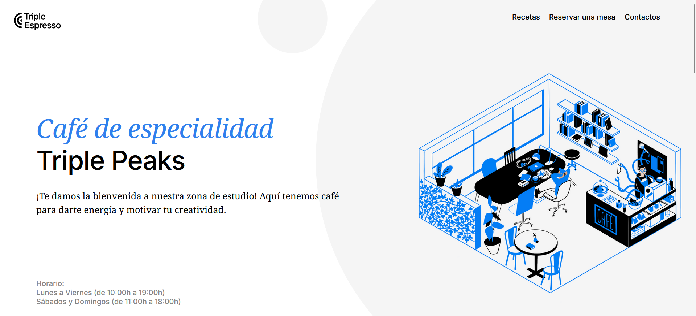

# Web Project CoffeeShop

## Descripción del Proyecto

**Web Project CoffeeShop** es una página web diseñada para una cafetería ficticia, mostrando habilidades de desarrollo web en **HTML**, **CSS**, y **JavaScript**. El sitio web presenta una interfaz de usuario atractiva y funcional con secciones clave como:

- **Menú**: Un vistazo a las opciones de bebidas y comidas.
- **Acerca de Nosotros**: Información sobre la historia y misión de la cafetería.
- **Formulario de Contacto**: Un espacio para que los clientes puedan dejar sus comentarios o consultas.

El objetivo de este proyecto es crear una experiencia inmersiva que refleje el ambiente acogedor de una cafetería.

## Tecnologías Utilizadas

- **HTML5**: Para la estructura semántica del sitio.
- **CSS3**: Para el diseño visual y la disposición.
- **JavaScript**: Para agregar interactividad y funcionalidad dinámica.

## Planes de Mejora

Durante el desarrollo del proyecto, se han identificado áreas para futuras mejoras, entre ellas:

1. **Sección de Blog**: Integrar un blog para compartir artículos sobre café, recetas, y novedades en eventos especiales.
2. **Sistema de Reservas**: Añadir una funcionalidad para que los usuarios puedan reservar mesas o pedidos en línea.
3. **Optimización para SEO**: Implementar mejores prácticas para mejorar la visibilidad en motores de búsqueda.

Estas mejoras no solo ampliarán la funcionalidad, sino que también enriquecerán la experiencia del usuario y aumentarán la interacción con el sitio.

## Demo del Proyecto

Puedes ver el proyecto en acción visitando este enlace: [Web Project CoffeeShop](https://zinderellasnuff.github.io/web_project_coffeeshop/)

---

¡Gracias por revisar mi proyecto! Estoy abierto a cualquier sugerencia para seguir mejorando mis habilidades en el desarrollo web.
